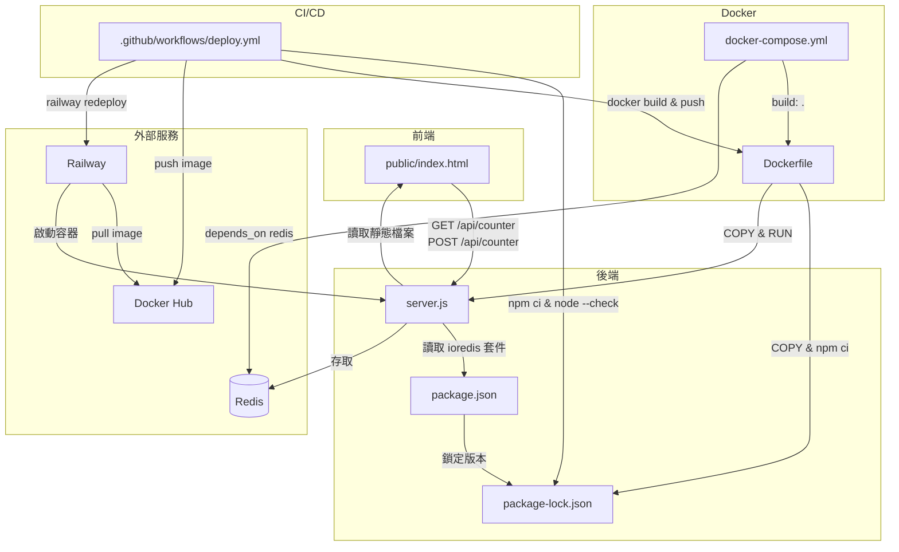

# 專案架構與檔案關聯

## 檔案結構

```
demo-02-railway-docker/
├── server.js                          # Node.js 主程式
├── public/
│   └── index.html                     # 前端頁面
├── package.json                       # 套件定義 & scripts
├── package-lock.json                  # 鎖定套件版本
├── Dockerfile                         # 建立 Docker Image
├── docker-compose.yml                 # 本機開發環境
└── .github/
    └── workflows/
        └── deploy.yml                 # CI/CD 流程
```

---

## 檔案關聯圖



---

## 各檔案職責說明

| 檔案 | 用途 | 依賴 |
|------|------|------|
| `server.js` | HTTP 伺服器，處理 API 與靜態檔案 | `ioredis`、`public/index.html` |
| `public/index.html` | 計數器前端，透過 fetch 呼叫 API | `server.js` (runtime) |
| `package.json` | 定義 `ioredis` 依賴與 npm scripts | - |
| `package-lock.json` | 鎖定確切套件版本與 hash | `package.json` |
| `Dockerfile` | 將 Node.js 應用打包成 Image | `package*.json`、`server.js` |
| `docker-compose.yml` | 本機一鍵啟動 app + Redis | `Dockerfile` |
| `deploy.yml` | CI/CD：測試 → Build → Push → 部署 | `package-lock.json`、`Dockerfile` |

---

## 環境對照

| 環境 | 啟動方式 | Redis 來源 |
|------|---------|-----------|
| 本機開發 | `docker compose up` | docker-compose 內建的 redis service |
| Railway 生產 | GitHub push → CI/CD 自動部署 | Railway 附加的 Redis 服務（`REDIS_URL`）|
```
